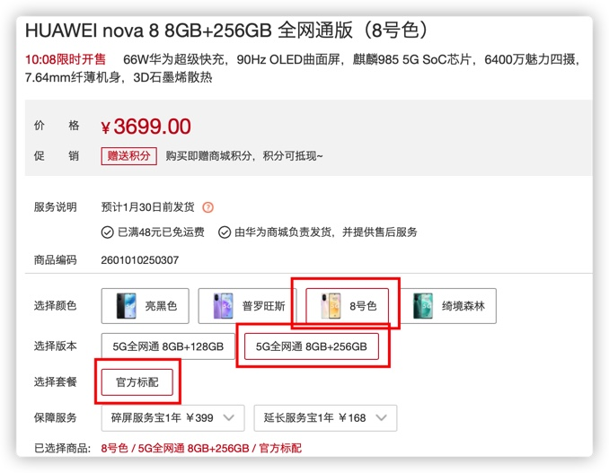

# HUAWEI STORE 2021

## 说明
基于Python3+Selenium的华为商城抢购爬虫脚本，修改自近两年没更新的项目[BUY-HW](https://github.com/wfdubowen/BUY-HW)，为女神抢Nova 8（什么时候华为开始学小米玩饥饿营销了？）

原项目的登陆以及抢购部分已经不可用，本项目对原项目进行了改正以适应新华为商城，并增加一些功能。

软件安装及配置可参考原作者文章：[Python+Selenium基础入门及实践](https://www.jianshu.com/p/1531e12f8852)的第一部分教学Selenium+Python环境搭建及配置。

本项目测试环境：macOS Big sur 11.2 Beta + Python3.9.1 + Chrome  87.0.4280.141 + Chrome Driver  87.0.4280.88实测正常可用

## 如何使用
- 参考原作者文章：[Python+Selenium基础入门及实践](https://www.jianshu.com/p/1531e12f8852)的第一部分教学进行Selenium+Python环境搭建及配置（程序猿忽略）。

  

  

- 配置demo.py中的ACCOUNTS信息，第一个为华为账户账号/电话/邮箱，第二个为账户密码。

- 配置chrome_driver属性，为计算机上下载的Chrome Driver路径。对于Windows，一般在Chrome安装目录下（C:\Google\ChromeApplication\chrome.exe）或者Python安装路径下（如原作者文章）。

- 配置BUY_URL，为你要抢购的商品的华为商城链接。比如华为Nova8 [https://www.vmall.com/product/10086232069466.html](https://www.vmall.com/product/10086232069466.html)最好剥离后面乱七八糟的参数，**只留下形如 https://www.vmall.com/product/这里是一坨数字.html 的形式**

- 配置BEGIN_GO，开始抢购时间，建议比开售时间提前10-30s，并提前2-5分钟启动python脚本，确保登陆成功，进入页面。

- 配置AUTO_SELECT，是否自动选择手机参数，比如颜色、版本、套餐，1为开启，0为关闭，否则程序会默认抢网页上的默认颜色、版本、套餐（一般是第一个）。如果你只要默认的颜色版本套餐，请AUTO_SELECT=0，这样可以稍微加快抢的速度并且大大降低一些错误（准备在下一个版本尝试修复）。如果你需要选其他颜色和版本套餐，请AUTO_SELECT=1，并且配置下面的选项：

  - [ ] AUTO_COLOR 是否启动自动选手机颜色，并且配置 COLOR 。例如 AUTO_COLOR=1    COLOR='8号色'

  - [ ] AUTO_EDITION 是否启动自动选手机颜色，并且配置 EDITION 。例如 AUTO_EDITION=1    EDITION='5G全网通 8GB+256GB'

  - [ ] AUTO_COMBO 是否启动自动选手机颜色，并且配置 COLOR 。例如 AUTO_COMBO=1    COMBO='官方标配'

    **这些和官网的选项是一致的，请大家务必准确一字不落，包括空格。对于程序员，建议打开控制台选择元素把文字复制出来。**

    

## 备注

毕竟是模拟手动，稍微加快了一点速度，剩下的就看网速啦哈哈，当然有较大几率抢购失败哈哈哈哈（脚本的错误我已经改的差不多了，剩下的都是华为和网速的锅），仅限于技术交流，严禁用于商业用途，黄牛走开！！！！

## WHATS NEW

### V2.0 2021.1.17

华为的登陆以及抢购等页面有部分修改。重新修改脚本以适应新变化，实测可用。

加入选择配置功能。

优化原脚本部分逻辑，减少错误。

好多好多。。。。。。

## WHATS NEXT

登陆界面加入自动获取二维码，自动跳过信任浏览器等功能。

修改选择配置部分逻辑，使得后面刷新快的时候也能保证配置选择OK。

## ABOUT ME

普通大二狗，没有学习过python，全程都是自己摸索出来的。有问题自己解决吧，百度一下很好使，学过任何一门编程语言的人都能自己摸索着改吧～