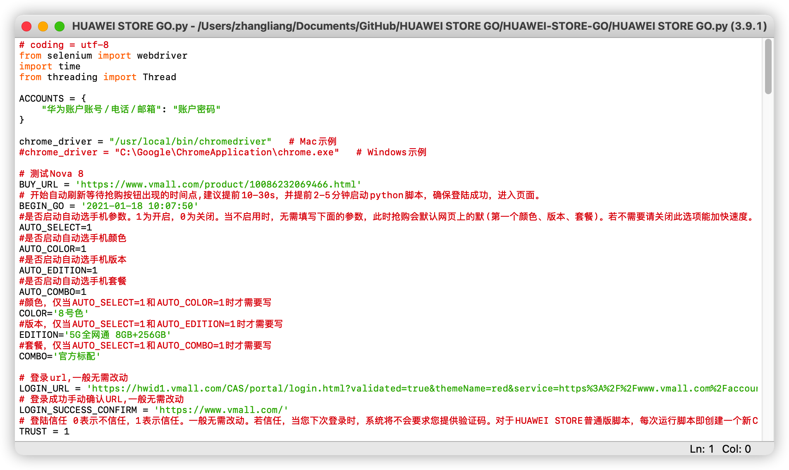

# HUAWEI STORE GO 2021

## 说明
基于Python3+Selenium的华为商城抢购爬虫脚本，修改自近两年没更新的项目[BUY-HW](https://github.com/wfdubowen/BUY-HW)，为女神抢Nova 8（什么时候华为开始学小米玩饥饿营销了？）

原项目的登陆以及抢购部分已经不可用，本项目对原项目进行了改正以适应新华为商城，并增加一些功能。

软件安装及配置可参考原作者文章：[Python+Selenium基础入门及实践](https://www.jianshu.com/p/1531e12f8852)的第一部分教学Selenium+Python环境搭建及配置。

本项目测试环境：macOS Big sur 11.2 Beta + Python3.9.1 + Chrome  87.0.4280.141 + Chrome Driver  87.0.4280.88实测正常可用

**<font color=#FD5365>本python脚本仅供大家学习交流，严禁严禁用于商业用途，不得利用本项目进行任何形式的盈利活动，请在24小时内删除</font>   **

<font color=#82AE9C>**如果本项目对你有所帮助，麻烦项目给个星星鼓励一下哦**</font> 


## 如何使用

### 对于普通玩家，直接下载HUAWEI STORE.py

- 参考原作者文章：[Python+Selenium基础入门及实践](https://www.jianshu.com/p/1531e12f8852)的第一部分教学进行Selenium+Python环境搭建及配置（程序猿忽略）。

  

  

- 配置demo.py中的ACCOUNTS信息，第一个为华为账户账号/电话/邮箱，第二个为账户密码。

  - [ ] 关于使用多账号（不建议，没有测试），每个信息之间用  ,  隔开，形如：

    ```python
    ACCOUNTS = {
        "账号1": "密码1",
        "账号2": "密码2"，
        ................
        "账号n": "密码n"
    }
    ```

    

  Ps:不可使用同一账号

- 配置chrome_driver属性，为计算机上下载的Chrome Driver路径。对于Windows，一般在Chrome安装目录下（C:\Google\ChromeApplication\chrome.exe）或者Python安装路径下（如原作者文章）。

- 配置BUY_URL，为你要抢购的商品的华为商城链接。比如华为Nova8 [https://www.vmall.com/product/10086232069466.html](https://www.vmall.com/product/10086232069466.html)最好剥离后面乱七八糟的参数，**只留下形如 https://www.vmall.com/product/这里是一坨数字.html 的形式**

- 配置BEGIN_GO，开始抢购时间，建议比开售时间提前10-30s，并提前2-5分钟启动python脚本，确保登陆成功，进入页面。

- 配置AUTO_SELECT，是否自动选择手机参数，比如颜色、版本、套餐，1为开启，0为关闭，否则程序会默认抢网页上的默认颜色、版本、套餐（一般是第一个）。如果你只要默认的颜色版本套餐，请AUTO_SELECT=0，这样可以稍微加快抢的速度并且大大降低一些错误（准备在下一个版本尝试修复）。如果你需要选其他颜色和版本套餐，请AUTO_SELECT=1，并且配置下面的选项：

  - [ ] AUTO_COLOR 是否启动自动选手机颜色，并且配置 COLOR 。例如 AUTO_COLOR=1    COLOR='8号色'

  - [ ] AUTO_EDITION 是否启动自动选手机颜色，并且配置 EDITION 。例如 AUTO_EDITION=1    EDITION='5G全网通 8GB+256GB'

  - [ ] AUTO_COMBO 是否启动自动选手机颜色，并且配置 COLOR 。例如 AUTO_COMBO=1    COMBO='官方标配'

    **这些和官网的选项是一致的，请大家务必准确一字不落，包括空格。对于程序员，建议打开控制台选择元素把文字复制出来。**

    

### 对于开发者，本项目在DEV文件夹中提供了DEV版本，加入了获取配置，免去每次运行脚本webdriver都创建一个新浏览器导致每次都需要验证。只需要第一次验证信任就可以免去验证的麻烦。适用于需要经常测试修改程序的开发者，或者是有一定操作经验的人。此版本无需验证使得从启动到抢购只需要不到十秒。

- 相对于普通版本，需要额外配置chrome个人资料路径。可以使用自己平常使用的Chrome的所有配置（不推荐，启用其他插件降低脚本效率），可以运行一遍普通版本然后提取所生成的Chrome配置（推荐），也可以直接用我DEV文件夹里提取好的Default配置文件夹（记得改成你的路径哦）。（注意，DEV版如果使用多账号会因为共用一个Chrome个人资料路径导致webdriver无法使用，无解。能力强的可以复制多个个人资料路径，然后写到python里，我暂时懒得搞，毕竟没系统学过python）

- 对于前两种，如何找到当前这个Chrome的配置路径？直接在地址栏输入chrome://version/就可以看到个人资料路径。

- 建议到Chrome设置里把首页改为脚本中的LOGIN_URL（https://hwid1.vmall.com/CAS/portal/login.html?validated=一坨一坨reqClientType=26&lang=zh-cn）

  
  
  否则使用自己的个人资料路径会出现在登陆界面卡十多秒的情况。目前原因不详。
  
  

## 备注

毕竟是模拟手动，稍微加快了一点速度，剩下的就看网速啦哈哈，当然有较大几率抢购失败哈哈哈哈（脚本的错误我已经改的差不多了，剩下的都是华为和网速的锅），**<font color=#D96126>仅限于学习技术交流，严禁用于商业用途，黄牛走开！！！！</font> **


# BUGS

部分会出现登陆时验证码跳过的情况。今晚修复，可以先用2.2版本。


## WHATS NEW

### V2.0 2021.1.17

华为的登陆以及抢购等页面有部分修改。重新修改脚本以适应新变化，实测可用。

加入选择配置功能。

优化原脚本部分逻辑，减少错误。

好多好多。。。。。。

### V2.1 2021.1.18

修改选择配置部分逻辑，使得后面刷新快的时候也能保证配置选择OK。

上线DEV版本，使得开发者修改测试更加容易。

### V2.2 2021.1.19

新增自动获取短信验证码，信任浏览器，加快登陆的操作。

优化大多数可能出错的场景，不限于：

- 登陆时有时候需要点击两次登陆按钮（不知道华为网页为什么这么干）
- 偶尔webdriver打开网页错误
- 优化速度（网速不好的小伙伴自觉把time.sleep( )的数字适当增加）


## WHATS NEXT

V2.3版本才注意到这个程序原是可以多账号的，一直只注意主体运行部分，没有注意其他的。准备完善一下多线程多账号。

不过大概率这是最后一个版本了，要去刷竞赛题了，这个版本基本够用了。。。。。。。。。。。。。。

有脚本+人工抢都抢不到，排队中排个寂寞，买个手机真恶心到了，对华为印象--


## ABOUT ME

普通大二狗，没有学习过python，全程都是自己摸索出来的。有问题自己解决吧，百度一下很好使，学过任何一门编程语言的人都能自己摸索着改吧～